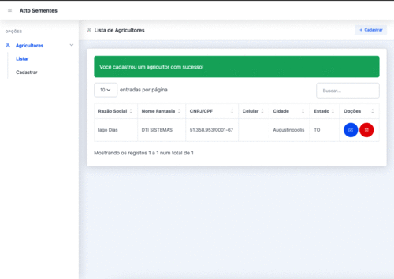

# Demo



# 👨🏻‍🌾 CRUD - Agricultor Atto Sementes 


Sistema desenvolvido em Laravel 10.x. Siga os comandos abaixo para executar a aplicação em sua máquina.


## Rodando localmente

Clone o projeto

```bash
  git clone https://github.com/iiagodias/atto-cadastro.git
```

Entre no diretório do projeto

```bash
  cd atto-cadastro
```

Instale as dependências

```bash
  composer install
```

Copie o .env.example com o nome .env e preencha os dados do seu banco MySQL.

Em seguida rode as migrations

```bash
  php artisan migrate
```

Agora vamos startar a aplicação

```bash
  php artisan serve
```


Foi utilizado um design system do SB Admin PRO, para o qual possuo a licença paga. 

## Stack utilizada

**Front-end:** Template Blade

**Back-end:** PHP com Laravel

